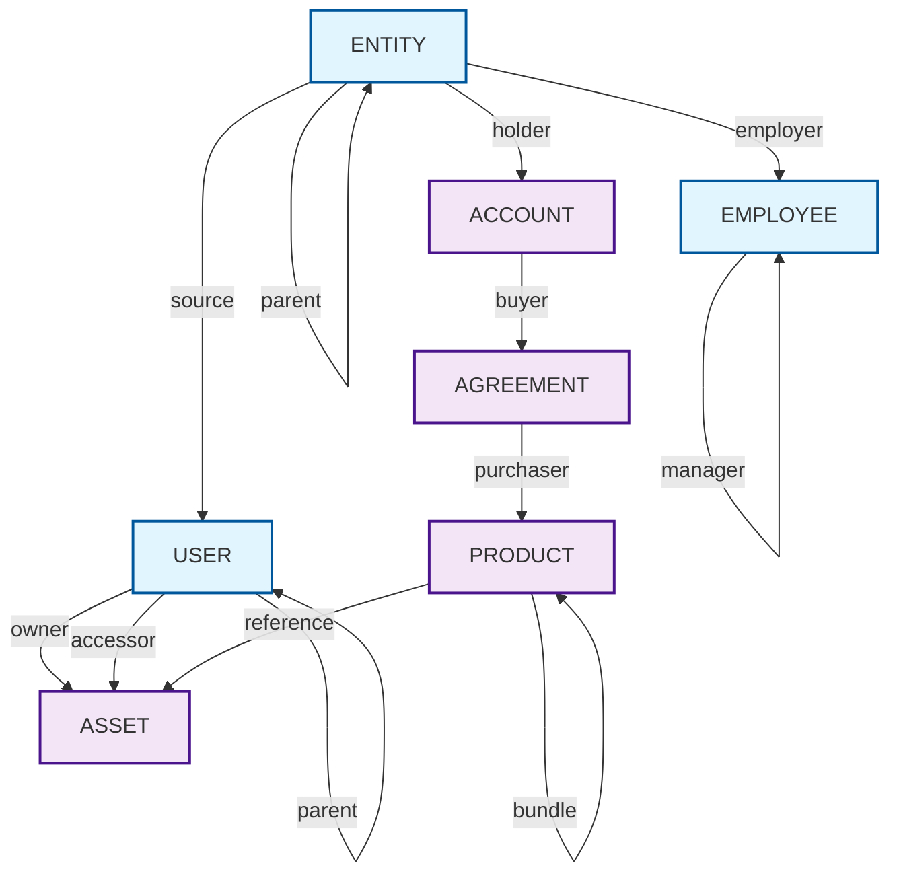
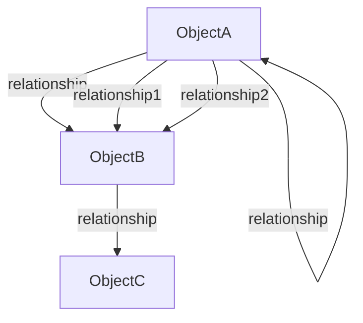

# Business Object Planning Methodology

A systematic approach to designing business objects and their relationships for the Object Evolution Framework. This methodology ensures consistent, deterministic architecture decisions that eliminate subjectivity and create predictable table structures.

## Overview

Business object planning is the foundation of the OEF methodology. Before writing any code, teams must complete three deliverables that fully specify the data architecture:

1. **Business Object Definitions** - What objects exist and their types
2. **Source System Mapping** - How raw data maps to business objects  
3. **Relationship DAG** - Visual specification of all direct relationships

This planning phase typically takes 4-8 weeks and eliminates architectural decisions during development.

## Core Principles

### Business Concepts Over Source Systems

Design objects based on how the business thinks about entities, not how legacy systems happen to store them. Source systems often create artificial separations for workflow convenience that shouldn't carry forward to the analytical model.

**Example:** Salesforce separates Leads and Contacts, but the business treats Contacts as the single source of truth. In OEF, this becomes Entity attributes rather than separate objects.

### Object Unification Tests

When evaluating whether to unify potential objects, apply these tests:

1. **Same Business Process Test** - Do they participate in the same business workflows?
2. **Duplicate Logic Test** - Would separating them require duplicate processing logic?
3. **Immutable Type Test** - Can one transform into the other during normal lifecycle?

If yes to the first two and no to the third, they're probably types of the same unified object.

### Relationship vs Object Test

Many source system "objects" are actually relationship data promoted to object status for transactional convenience. Ask: "Does this primarily exist to connect two other business concepts and have no meaningful independent lifecycle?" If yes, it's relationship data, not a separate business object.

**Example:** Quote Line Items are really Agreement-Product relationships with attributes (quantity, price), not independent objects.

### Maximum Utility Principle

Preserve all business value from source systems while eliminating structural complexity. System artifacts like workflow states become attributes or flags rather than separate objects.

## Business Object Definitions

### Step 1: Inventory Potential Objects

List all entities from source systems and stakeholder requirements. Don't worry about structure yet - just capture everything that might be an object.

### Step 2: Apply Unification Tests

Group potential objects using the tests above. Look for:
- Objects that would create parallel table structures (Sheet_User_Sharing, Dashboard_User_Sharing → ASSET_SHARING)
- Workflow artifacts that represent the same business concept (Lead, Contact → Entity attributes)
- Multiple objects with mostly shared attributes

### Step 3: Define Unified Objects with Types

For each unified object, specify:

**Object Name:** Clear, singular noun
**Purpose:** Why this object exists in the business
**Types:** When immutable distinctions are necessary
**Core Attributes:** Shared attributes across all types
**Lifecycle:** How the object is created, modified, deleted

### Common Business Objects

**ENTITY**
- Real-world actors that exist independently
- Types: person, organization, facility, group
- Test: Can make decisions, own things, be contacted

**USER**  
- System interaction contexts
- Types: by discrete systems when business logic differs
- Test: Has authentication, permissions, usage patterns

**EMPLOYEE**
- Employment relationship contexts
- Types: by discrete companies when systems are separate
- Test: Has employment status, reporting structure, role

**ACCOUNT**
- Commercial relationship between our company and an Entity
- Usually no types needed - variations are attributes
- Test: Represents "we do business with this entity"

**AGREEMENT**
- Commercial terms and commitments
- Types: quote, contract, subscription (different legal frameworks)
- Test: Has legal/commercial obligations

**PRODUCT**
- Things that can be sold/delivered
- Types: physical, digital, service (different fulfillment models)
- Test: Has pricing, can be purchased

**ASSET**
- Things owned that have ongoing value/management needs
- Types: physical, digital, financial, intellectual
- Test: Requires ongoing management, has ownership

### Object Definition Template

```markdown
## [OBJECT_NAME]

**Purpose:** [Why this object exists in the business]

**Types:**
- [type_name]: [When to use this type]
- [type_name]: [When to use this type]

**Unification Rationale:** 
[Why these are unified vs. separate objects]

**Core Attributes:**
- [attribute]: [Description]
- [attribute]: [Description]

**Lifecycle:**
- Created when: [Trigger]
- Modified when: [Trigger]  
- Deleted when: [Trigger]
```

## Source System Mapping

### Step 1: Source System Inventory

For each source system, document:
- System name and purpose
- All tables/objects that contain business data
- Key fields and their business meaning
- Data quality and completeness
- Update frequency and timing

### Step 2: Map Source Objects to Business Objects

Create explicit mappings showing:

**Source Object → Business Object.Type**
**Field Mappings:** Source field → Business object attribute
**Transformation Logic:** Any conversion rules needed
**Data Quality Issues:** Known problems and handling approach

### Step 3: Handle Source System Artifacts

Identify and plan for:
- **Workflow states** → Business object attributes/flags
- **Duplicate data** → Single business object with source context
- **Relationship tables** → Direct relationships vs. denormalized attributes

### Mapping Template

```markdown
## [Source_System_Name]

### [source_table] → [BUSINESS_OBJECT].[type]

**Field Mappings:**
- source_field → business_attribute
- source_field → business_attribute

**Transformation Logic:**
- [Any special handling needed]

**Data Quality:**
- [Known issues and handling]

**Notes:**
- [Important context about this mapping]
```

## Relationship DAG

### Step 1: Identify Direct Relationships

Direct relationships get their own normalized tables. Indirect relationships only appear as foreign keys in denormalized layers.

**Direct relationship criteria:**
- The relationship has its own business meaning and attributes
- You need to query/report on the relationship itself
- The relationship has its own lifecycle (created, modified, ended)

### Step 2: Apply DAG Rules

**Arrow Direction:** Always flows from "one" to "many" (hierarchical)
- One entity has many users
- One user owns many assets  
- One employee manages many employees

**Edge Labels:** Single word describing what the upstream object IS TO the downstream object
- `USER -->|owner| ASSET` means "User is the owner of Asset"
- `EMPLOYEE -->|manager| EMPLOYEE` means "Employee is the manager of Employee"

**Primary Object Rule:** The target of the arrow (downstream) becomes the primary object in table naming
- `USER -->|owner| ASSET` creates table **asset_owner_h**
- `USER -->|accessor| ASSET` creates table **asset_access_h**

### Step 3: Create the DAG

Use Mermaid syntax to create your business object relationship diagram:



### Creating Mermaid Diagrams

**Tools:**
- [Mermaid Live Editor](https://mermaid.live/) - Online editor with real-time preview
- VS Code with Mermaid extension - Local editing with preview
- GitHub/GitLab - Native Mermaid rendering in markdown

**Basic Syntax:**


**Styling Options:**
```mermaid
    %% Define styles
    classDef className fill:#color,stroke:#color,stroke-width:2px
    
    %% Apply to objects
    class OBJECT1,OBJECT2 className
```

### DAG Validation

Your completed DAG should:
- Show all business objects as nodes
- Include all direct relationships as labeled edges
- Follow consistent arrow direction (one-to-many)
- Use single-word relationship labels
- Handle self-referential relationships where they exist
- Be visually clear and logical

**Warning signs:**
- Bidirectional arrows (pick one primary direction)
- Multi-word relationship labels (simplify to single concept)  
- Objects with no relationships (might not be objects)
- Cycles that aren't self-referential (review object boundaries)

## Implementation Results

### Table Naming from DAG

Each edge in the DAG translates directly to a relationship table:

- `USER -->|owner| ASSET` → **asset_owner_h** table
- `USER -->|accessor| ASSET` → **asset_access_h** table  
- `EMPLOYEE -->|manager| EMPLOYEE` → **employee_manager_h** table

**Table Structure:**
```sql
-- asset_owner_h
asset_id (PK)
user_id (PK) 
valid_from (PK)
valid_to
-- relationship attributes
-- standard meta fields

-- asset_access_h
asset_id (PK)
user_id (PK)
valid_from (PK)
valid_to
permissions
-- other relationship attributes
-- standard meta fields
```

### Processing Dependencies

The DAG determines build order - objects higher in the hierarchy must be built before objects that depend on them:

1. **Source Layer (SRC):** Build all source tables first
2. **Vault Transformation (VLTX):** 
   - ENTITY (no dependencies on other business objects)
   - USER, EMPLOYEE, ACCOUNT (depend on ENTITY registry)
   - AGREEMENT (depends on ACCOUNT registry)  
   - PRODUCT (depends on AGREEMENT registry)
   - ASSET (depends on USER and PRODUCT registries)
3. **Vault Layer (VLT):** Consolidate across sources using VLTX dependencies
4. **Warehouse Layers (WHX, WH):** Denormalize and add metrics following vault dependencies

### Registry Table Strategy

Each business object gets a registry table in VLTX that maps key source identifiers to business object IDs:

- `entity_r` - Maps key source (email, DUNS) to entity business IDs
- `user_r` - Maps key source (employee ID) to user business IDs  
- `account_r` - Maps key source (CRM account ID) to account business IDs

**Key Source Selection:** Choose the source with 1:1 cardinality and best data quality as the authoritative identifier for each business object type.

### Cross-Type Analytics

The unified approach enables powerful cross-type analysis:
- Asset sharing patterns across all user types
- Entity relationships across person/organization types
- Product bundling across physical/digital types

## Deliverables Checklist

### Business Object Definitions ✓
- [ ] All business objects identified and defined
- [ ] Types specified with clear distinctions  
- [ ] Unification rationale documented
- [ ] Core attributes and lifecycle specified

### Source System Mapping ✓
- [ ] All source systems inventoried
- [ ] Object-to-object mappings complete
- [ ] Field transformation logic specified
- [ ] Data quality issues identified
- [ ] Key source selection documented

### Relationship DAG ✓
- [ ] All business objects included as nodes
- [ ] All direct relationships shown as edges
- [ ] Arrow direction consistent (one-to-many)
- [ ] Edge labels are single words
- [ ] Self-referential relationships included
- [ ] DAG is visually clear and logical

### Validation ✓
- [ ] DAG can be drawn without contradictions
- [ ] Source mappings are complete and logical
- [ ] Object definitions support planned use cases
- [ ] Table naming conventions are consistent
- [ ] Processing dependencies are clear
- [ ] Registry strategy documented

## Next Steps

With these deliverables complete, teams can proceed to implementation with confidence:

1. **Environment Setup** - Deploy OEF package and scaffold repository
2. **Layer Development** - Build tables systematically using provided templates
3. **Testing** - Validate data flows and transformations
4. **Deployment** - Move to production with complete architectural specification

The planning investment eliminates architectural decisions during development and ensures consistent, predictable table structures across the entire data warehouse.